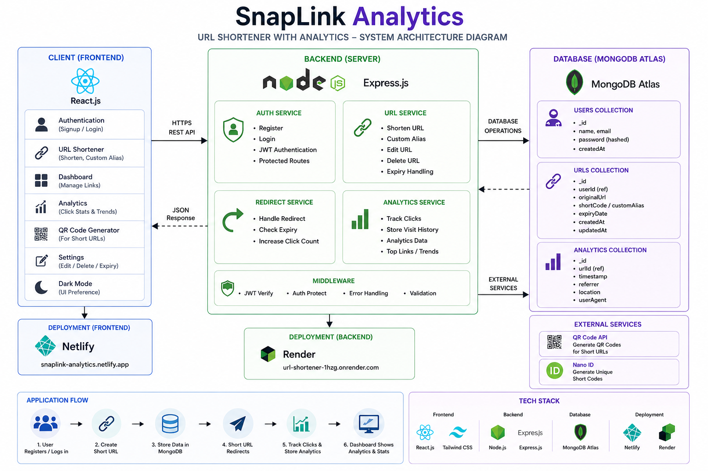

SnapLink Analytics — Shorten • Track • Analyze

A modern full-stack URL Shortener with Analytics built using the MERN Stack.

🌐 Live Deployment Links
Frontend (Netlify)

SnapLink Analytics Frontend

Backend API (Render)

SnapLink AnalyticsBackend API

Demo Video (Loom)
SnapLink AnalyticsDemo Video

🚀 Setup Instructions
1️⃣ Clone the Repository
git clone YOUR_GITHUB_REPOSITORY_LINK
2️⃣ Navigate to Project Folder
cd katomaran
📦 Backend Setup
3️⃣ Navigate to Backend Folder
cd server
4️⃣ Install Backend Dependencies
npm install
5️⃣ Create Environment Variables

Create a .env file inside the server folder and add:

PORT=5000
MONGO_URI=YOUR_MONGODB_ATLAS_URI
JWT_SECRET=YOUR_SECRET_KEY
CLIENT_URL=http://localhost:5173
6️⃣ Start Backend Server
npm start

Backend will run on:

http://localhost:5000
💻 Frontend Setup
7️⃣ Open New Terminal

Navigate to frontend folder:

cd client
8️⃣ Install Frontend Dependencies
npm install
9️⃣ Start Frontend
npm run dev

Frontend will run on:

http://localhost:5173
✅ Application Ready

Now open the frontend URL in the browser and use the application.

Users can:

Signup/Login
Create Short URLs
Generate Custom Aliases
Track Analytics
View Click Statistics
Edit/Delete URLs
Copy Short Links
Generate QR Codes
Use Dark Mode
Monitor URL Expiry
🧪 Assumptions Made
Users must register and login before accessing dashboard features.
Each authenticated user can manage only their own URLs.
MongoDB Atlas is used for cloud database storage.
JWT tokens are used for secure authentication and protected routes.
Short URLs redirect through backend APIs.
Analytics are tracked during every redirect request.
Expired URLs should stop redirecting after expiry.
Users are expected to enter valid URLs beginning with http:// or https://.
QR codes work properly after deployment using production URLs.
Internet connection is required for API communication.
The application is optimized for modern browsers and responsive devices.
Environment variables are mandatory for backend configuration and security.
REST APIs are used for frontend-backend communication.
Render and Netlify are used for deployment hosting.
🧠 AI Planning Document
📌 Project Goal

The primary goal of Katomaran is to build a production-style full-stack URL Shortener platform with analytics tracking using the MERN Stack.

The application enables users to:

Shorten long URLs
Manage links through a dashboard
Track analytics
Generate QR codes
Customize aliases
Monitor URL performance
🛠️ Development Planning Workflow
Phase 1 — Authentication System
Planned Features
User Signup
User Login
JWT Authentication
Protected Routes
Implementation
Created authentication APIs using Express.js
Implemented JWT-based authentication
Stored authentication tokens securely
Protected dashboard routes using middleware
Phase 2 — URL Shortening Logic
Planned Features
Generate short URLs
Unique short code generation
URL validation
Redirect handling
Implementation
Used NanoID for generating unique short codes
Stored URL data in MongoDB Atlas
Implemented redirect APIs
Added backend URL validation
Phase 3 — User Dashboard
Planned Features
Display all shortened URLs
Copy links
Delete URLs
Responsive dashboard
Implementation
Built dashboard using React
Added responsive layouts
Implemented copy-to-clipboard functionality
Added loading states and toast notifications
Phase 4 — Analytics System
Planned Features
Click tracking
Analytics dashboard
Visit history
Trend visualization
Implementation
Stored click analytics in MongoDB
Tracked redirect events
Built analytics dashboard
Added charts and visualizations
Phase 5 — Bonus Features
Implemented Features
QR Code generation
Custom aliases
Expiry date support
Edit URL functionality
Dark Mode
Analytics charts

Architecture Diagram

